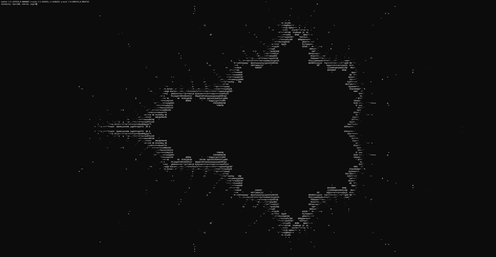

# FractalASCII

ASCII drawn [Mandelbrot set](https://en.wikipedia.org/wiki/Mandelbrot_set) terminal navigator. Made with [ncurses](https://en.wikipedia.org/wiki/Ncurses). <br>
Coding practice, developed on a raspberryPi. License: MIT. 
<br>

# Setup

```shell
sudo apt-get install libncurses5-dev libncursesw5-dev build-essential make 
git clone https://github.com/lukasnee/fractalascii.git
cd fractalascii
make fractalascii
sudo chmod +x fractalascii
./fractalascii
```

# Controls


# TODO
- Camera rotation
- Rewrite all in C++
